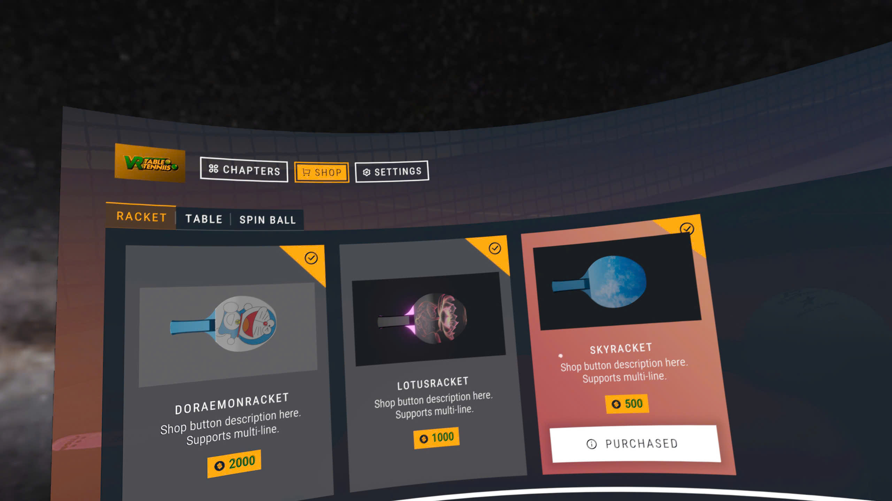
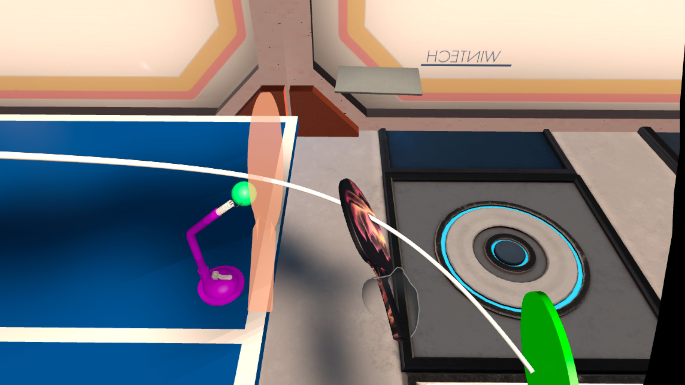
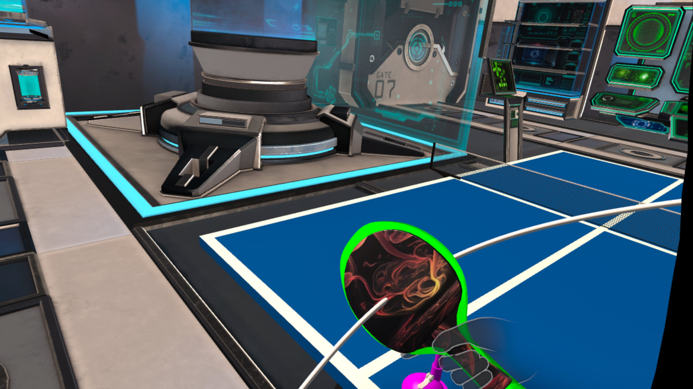
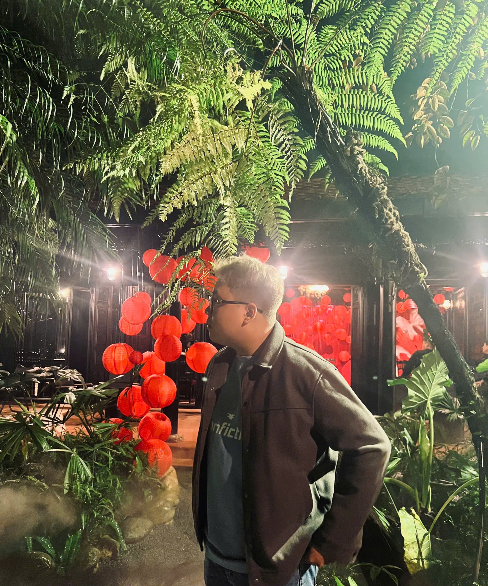
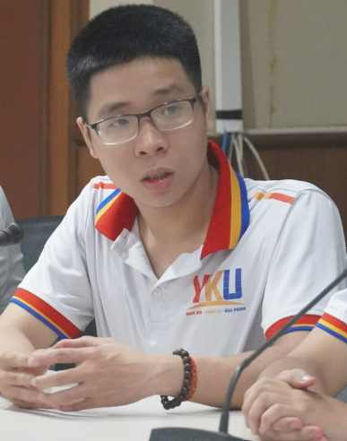

# TableTennis VR 🏓

<div align="center">
  
  
  **An immersive virtual reality table tennis experience for Meta Quest devices**
  
  
  
  
  
</div>

---

## ⚠️ **ACADEMIC RESEARCH NOTICE**

> **🎓 FOR RESEARCH AND EDUCATIONAL PURPOSES ONLY**
>
> This repository contains research code developed for academic publication in a Q1 VR journal. The code is provided **EXCLUSIVELY** for:
>
> - Academic research and reference
> - Educational purposes
> - Peer review and reproducibility
>
> **❌ PROHIBITED USES:**
>
> - Commercial applications or distribution
> - Production deployment
> - Modified versions for commercial use
> - Any use outside academic research context
>
> **No permissions are granted for commercial use, redistribution, or derivative works beyond academic research. All rights reserved by the research team.**

---

## 🎯 Overview

TableTennis VR delivers a cutting-edge virtual reality table tennis experience that combines realistic physics simulation with intuitive VR controls. Built specifically for Meta Quest devices using Unity 6 LTS, this game provides an authentic ping-pong experience that challenges players of all skill levels.

**This implementation serves as a research prototype for our academic paper on VR physics simulation and haptic feedback in virtual sports environments.**

<!-- <div align="center"> -->
<!--    -->
<!-- </div> -->

## ✨ Key Features

### 🎮 **Immersive Gameplay**

- **Realistic Physics Engine**: Advanced ball trajectory and paddle interaction simulation
- **Haptic Feedback**: Tactile responses for enhanced immersion
- **Dynamic Difficulty**: Adaptive AI that scales with player skill level

### 🏟️ **Customizable Environments**

- **Multiple Venues**: From classic indoor courts to exotic outdoor locations
- **Environmental Effects**: Dynamic lighting, weather conditions, and ambient sounds
- **Personalization**: Customize paddles, balls, and table designs

### 🎯 **Precision Controls**

- **Natural Hand Tracking**: Intuitive paddle movements that mirror real-world play
- **Gesture Recognition**: Serve and spin techniques using natural motions
- **Calibration System**: Personalized setup for optimal comfort and performance

### 🏆 **Game Modes**

- **Single Player**: Practice against AI opponents with varying difficulty levels
- **Training Mode**: Skill-building exercises and technique refinement
- **Tournament Mode**: Competitive matches with progression system
- **Free Play**: Unrestricted practice sessions

## 🖼️ Screenshots

<div align="center">
  <table>
    <tr>
      <td></td>
      <td></td>
      <td></td>
    </tr>
    <tr>
      <td align="center"><em>Main Menu Interface</em></td>
      <td align="center"><em>Intense Gameplay Action</em></td>
      <td align="center"><em>Customizable Environment</em></td>
    </tr>
  </table>
</div>

## 🛠️ Technical Specifications

### **Engine & Platform**

- **Unity Version**: 6 LTS (6000.0.51f1)
- **Target Platform**: Meta Quest
- **Rendering Pipeline**: Universal Render Pipeline (URP)
- **Physics Engine**: Unity Physics with custom ball dynamics

### **Performance Metrics**

- **Target FPS**: 90 FPS (Quest 2) / 120 FPS (Quest 3)
- **Resolution**: 1832×1920 per eye (Quest 2) / 2064×2208 per eye (Quest 3)
- **Memory Usage**: <2GB RAM
- **Storage**: ~500MB installation size

## 🚀 Quick Start

### **Prerequisites**

```
Unity 6 LTS (6000.0.51f1)
Meta Quest Development Setup
Meta Quest Link (for PC development)
Android SDK & NDK
```

### **Installation**

1. **Clone the repository**

   ```bash
   git clone https://github.com/yourusername/TableTennisXRgame.git
   cd TableTennisXRgame
   ```

2. **Open in Unity**
   - Launch Unity Hub
   - Select "Open" and navigate to the project folder
   - Ensure Unity 6 LTS is selected

3. **Configure Build Settings**
   - File → Build Settings → Android
   - Switch Platform to Android
   - Configure XR settings for Meta Quest

4. **Install Dependencies**

   ```
   Window → Package Manager
   Install: Meta XR All-in-One SDK
   Install: XR Plug-in Management
   ```

### **Development Setup**

1. **Enable Developer Mode** on your Meta Quest device
2. **Connect via USB** and enable USB debugging
3. **Build and Run** directly to your headset

## 📦 Dependencies

| Package | Version | Purpose |
|---------|---------|---------|
| Meta XR All-in-One SDK | Latest | Core VR functionality for Meta Quest |
| XR Plug-in Management | Latest | XR configuration and initialization |
| Universal Render Pipeline | 14.0+ | Optimized rendering for VR |
| TextMeshPro | Latest | UI text rendering |
| Unity Physics | Latest | Physics simulation |

## 🎮 Controls

### **Paddle Control**

- **Natural Grip**: Hold controller naturally as a paddle
- **Wrist Rotation**: Control paddle angle and spin
- **Trigger**: Grip strength adjustment

### **Movement**

- **Room Scale**: Physical movement within play area
- **Teleportation**: Quick positioning (optional)

### **Menu Navigation**

- **Point & Click**: Use controller ray-casting
- **Hand Tracking**: Direct interaction with UI elements

## 🔧 Configuration

### **Graphics Settings**

```json
{
  "renderScale": 1.0,
  "textureQuality": "High",
  "shadowQuality": "Medium",
  "antiAliasing": "4x MSAA"
}
```

### **Physics Settings**

```json
{
  "ballBounceRestitution": 0.8,
  "tableFriction": 0.6,
  "airResistance": 0.02,
  "gravityScale": 1.0
}
```

## 📖 Research Context

This VR table tennis implementation was developed as part of our research on:

- **Haptic Feedback Systems** in virtual sports environments
- **Physics Simulation Accuracy** in VR gaming
- **User Experience Design** for immersive VR applications
- **Performance Optimization** for standalone VR devices

### **Citation**

If you reference this work in your research, please cite our paper:

```bibtex
@article{tabletennis_vr_2025,
  title={Advanced Physics Simulation and Haptic Feedback in Virtual Reality Table Tennis},
  author={Nguyen Le Tat Phu and Doan Cat Phu},
  journal={Q1 VR Journal},
  year={2025},
  note={In Press}
}
```

## 🤝 Academic Collaboration

We welcome collaboration from fellow researchers! For academic inquiries:

1. Fork the repository for research purposes
2. Create your research branch (`git checkout -b research/YourStudy`)
3. Document your modifications and findings
4. Share results with the academic community

**Note: All academic use must be properly cited and attributed.**

## 📊 Roadmap

### **Phase 1: Core Features** ✅

- [x] Basic paddle mechanics
- [x] Ball physics simulation
- [x] Single-player mode
- [x] Basic UI implementation

### **Phase 2: Enhanced Experience** 🚧

- [ ] Multiplayer support
- [ ] Advanced AI opponents
- [x] Achievement system
- [x] Social features

### **Phase 3: Advanced Features** 📋

- [x] Hand tracking support
- [ ] Spectator mode
- [ ] Replay system
- [ ] Analytics dashboard

## 🐛 Known Issues

- [ ] Occasional tracking drift during intense gameplay
- [ ] Minor audio delay in some environments
- [ ] Performance optimization needed for complex scenes

## 🏆 Research Recognition

- **Meta Quest Store**: Featured Application

## 📞 Academic Support

- **Documentation**: [Research Wiki](https://github.com/yourusername/TableTennisXRgame/wiki)
- **Issue Tracker**: [GitHub Issues](https://github.com/yourusername/TableTennisXRgame/issues)
- **Academic Inquiries**: <research@tabletennisxr.com>

## 📄 License

This project is licensed under **Academic Research License** - see the [LICENSE](LICENSE) file for details.

**IMPORTANT**: This code is provided for academic research purposes only. Commercial use, redistribution, or derivative works are strictly prohibited without explicit written permission from the research team.

## 👥 Research Team

<div align="center">
  <table>
    <tr>
      <td align="center">
        <br>
        <b>Nguyen Le Tat Phu</b><br>
        <em>Lead Developer & VR Specialist</em>
      </td>
      <td align="center">
        <br>
        <b>Doan Cat Phu</b><br>
        <em>Game Designer</em>
      </td>
    </tr>
  </table>
</div>

---

<div align="center">
  <p>
    <strong>🎓 Academic Research Project - Q1 VR Journal Publication 🎓</strong>
  </p>
  
  [](https://your-paper-link)
  [](https://github.com/yourusername/TableTennisXRgame/releases)
</div>

---

<div align="center">
  <sub>Built with ❤️ for the VR research community | For Academic Use Only</sub>
</div>
